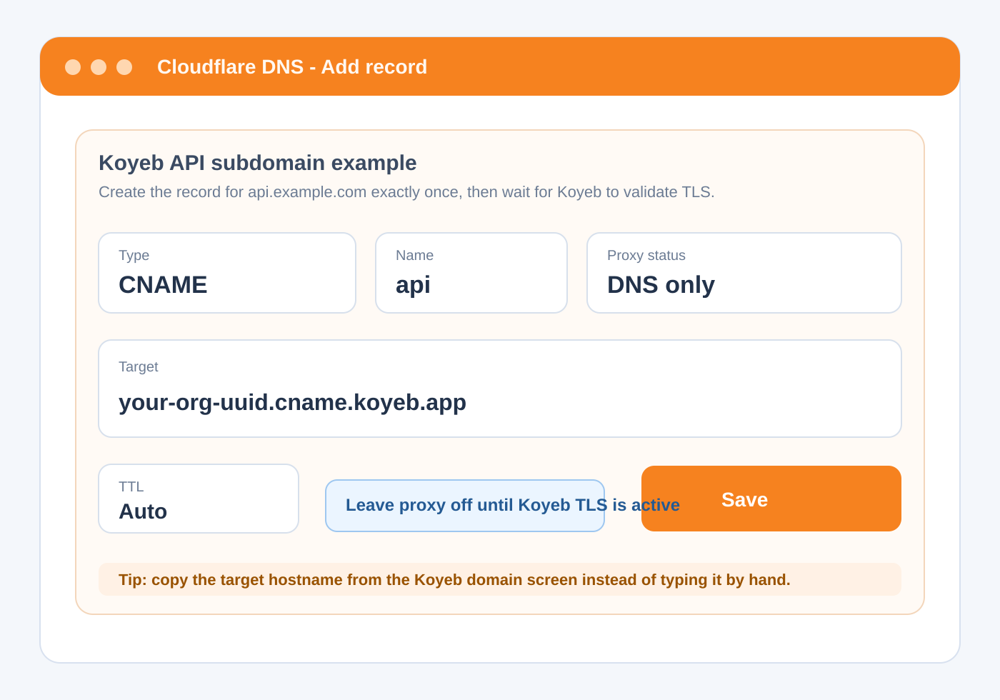
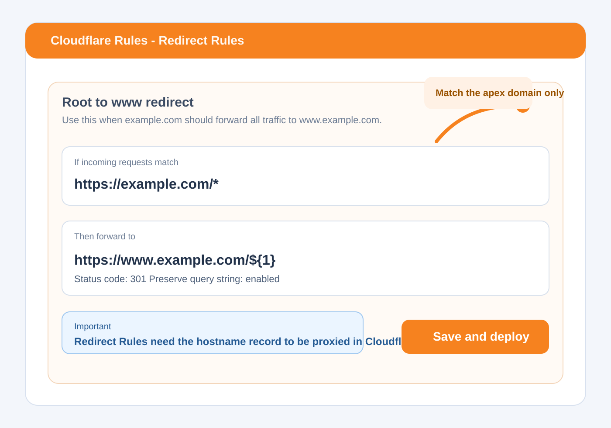
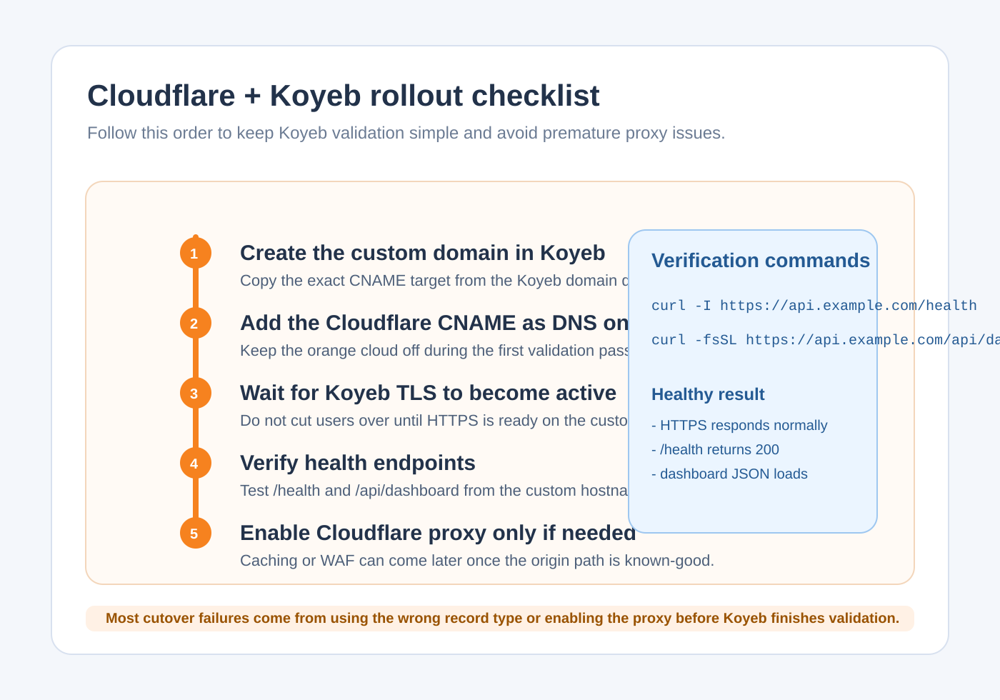

# Cloudflare DNS visual guide

This companion guide adds screenshot-style field maps for the Cloudflare dashboard.

Use it with:

- [cloudflare-dns-examples.md](/Users/dennis_leedennis_lee/Documents/GitHub/The Trojan Horse Approach/docs/runbooks/cloudflare-dns-examples.md)
- [koyeb-custom-domain.md](/Users/dennis_leedennis_lee/Documents/GitHub/The Trojan Horse Approach/docs/runbooks/koyeb-custom-domain.md)

## 1. Add the API CNAME for Koyeb

Fill the Cloudflare DNS form like this:

Use:

- Type: `CNAME`
- Name: `api`
- Target: the exact `*.cname.koyeb.app` hostname Koyeb gives you
- Proxy status: `DNS only`
- TTL: `Auto`

## 2. Add the root-domain redirect rule

If you want `example.com` to redirect to `www.example.com`, configure a redirect rule like this:

Use:

- If URL matches: `https://example.com/*`
- Then forward to: `https://www.example.com/${1}`
- Status code: `301`
- Preserve query string: enabled

## 3. Roll out in the safe order

Before enabling the Cloudflare proxy, follow this order:

Recommended sequence:

1. create the Koyeb custom domain first
2. add the `CNAME` as `DNS only`
3. wait for Koyeb TLS to become active
4. verify `/health` and `/api/dashboard`
5. only then decide whether to enable Cloudflare proxy

## Quick reminders

- Do not point an `A` record at Koyeb for the API subdomain.
- Keep the first Koyeb cutover on `api.example.com`, not the apex domain.
- Redirect Rules need proxied records, but Koyeb validation is easiest with the service `CNAME` set to `DNS only` first.
